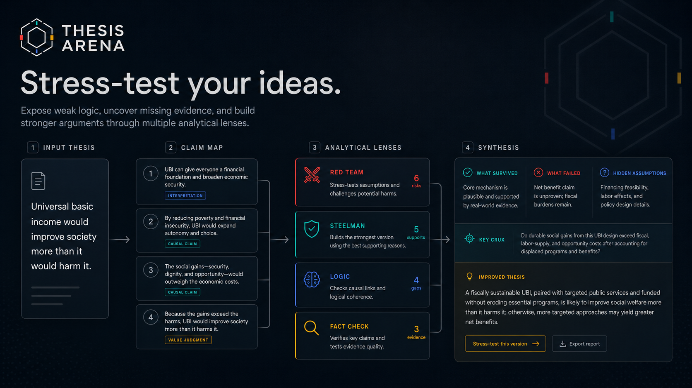
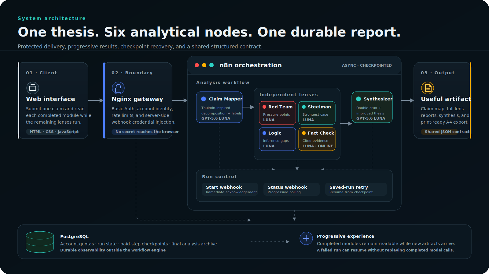

# Thesis Arena

> Turn any claim into a multi-agent stress test that exposes weak logic,
> missing evidence, and stronger arguments.

[](https://openai.devpost.com/)
[](https://developers.openai.com/)
[](https://n8n.io/)
[](LICENSE)



Thesis Arena is a reasoning instrument for pressure-testing an idea before you
publish, teach, debate, or make a decision around it. It decomposes one thesis
into claims, examines those claims through independent analytical lenses, and
rebuilds the result into a more defensible formulation.

This is not a chatbot thread and not four personalities producing unrelated
opinions. Every stage returns a structured artifact that is validated, saved,
rendered progressively, and reused by the final synthesis.

**OpenAI Build Week track:** Education  
**Live demo:** protected judge access is supplied privately in the Devpost submission.

## Product flow

1. **Claim Map** separates empirical, causal, interpretive, predictive, and
   value claims using a Toulmin-inspired structure.
2. **Red Team** finds hidden assumptions, counterexamples, omitted alternatives,
   and failure modes.
3. **Steelman** produces the strongest defensible version of the argument,
   including qualifications and missing warrants.
4. **Logic** checks consistency, causality, scope, and inferential jumps.
5. **Fact Check** separates externally verifiable claims from opinion and returns
   evidence statuses with source links.
6. **Synthesis** records what survived, what failed, the hidden assumptions, the
   key crux, and an improved thesis.

The compact cards make the result scannable. Each card opens into a full report
whose count is derived from the actual findings array. The final analysis can be
exported as a print-ready PDF or sent through another stress-test cycle.

## Architecture



The browser starts a run and receives an execution ID immediately. n8n saves
each checkpoint to PostgreSQL while the browser polls a lightweight status
workflow. Completed modules appear as soon as they are available, so the user
can read Red Team or Steelman while the remaining analysis continues.

If a run is interrupted, the retry workflow resumes the saved n8n execution
instead of repeating already completed paid model stages.

## Technical highlights

- Six specialized GPT-5.6 Luna nodes, including cited online Fact Check.
- Strict shared JSON contract across n8n, frontend, mocks, storage, and reports.
- Progressive delivery of Claim Map and analytical lenses.
- Saved-execution retry from the last successful checkpoint.
- PostgreSQL run archive with model, duration, stage, error, and final payload.
- Atomic account quota check before any paid model node runs.
- Nginx isolation, Basic Auth, rate limiting, and server-side secret injection.
- Dedicated A4 HTML/CSS report instead of screenshot-based PDF generation.
- Dependency-free browser application and deterministic local mock mode.

## Run locally

The local version requires no API keys, package installation, or build step.

```powershell
node server.cjs
```

Open `http://127.0.0.1:4173`.

The default `config.js` uses deterministic mock data, including detailed lens
findings and Fact Check sources clearly marked as mock evidence. This is the
recommended path for reviewing the UI and data contract without spending model
credits.

## Connect n8n

1. Apply [`database/schema.sql`](database/schema.sql) to PostgreSQL.
2. Create OpenRouter, PostgreSQL, Header Auth, and n8n API credentials inside
   n8n.
3. Copy `.env.example` to `.env` and provide the corresponding n8n credential
   IDs. Do not put API keys in these variables.
4. Generate credential-bound workflow exports:

```powershell
node scripts/build-n8n-workflow.mjs
node scripts/build-n8n-control-workflows.mjs
```

5. Import and activate the three files from `n8n/`.
6. Configure the browser API boundary in `config.js` or use the same-origin Nginx
   example in `deploy/`.

The committed workflow JSON files are deliberately credential-free. After
import, n8n will ask you to select credentials for the affected nodes.

## Models

The live analytical layer uses:

```text
Claim Mapper   openai/gpt-5.6-luna
Red Team       openai/gpt-5.6-luna
Steelman       openai/gpt-5.6-luna
Logic          openai/gpt-5.6-luna
Fact Check     openai/gpt-5.6-luna:online
Synthesizer    openai/gpt-5.6-luna
```

OpenRouter is used as the transport layer. The analytical model is GPT-5.6, and
the final run metadata records the model identifiers that were configured.

## Data contract

[`analysis-schema.json`](analysis-schema.json) is the canonical contract.
UI rendering, report rendering, mocks, PostgreSQL payloads, and n8n outputs use
the same structure.

Important invariants and integration notes are documented in
[`docs/DATA_CONTRACT.md`](docs/DATA_CONTRACT.md).

## Built with Codex and GPT-5.6

ChatGPT was used for product methodology, the analytical framework, positioning,
visual direction, and review. Codex handled the implementation loop across the
frontend, n8n workflow generation, PostgreSQL, Nginx, deployment, debugging, and
production verification.

GPT-5.6 Luna is also the runtime reasoning layer inside the finished product.

The complete build narrative, key decisions, production challenge, and lessons
learned are documented in [`docs/BUILT_WITH_CODEX.md`](docs/BUILT_WITH_CODEX.md).

## Repository structure

```text
index.html                 application shell
app.js                     state machine, rendering, and API client
styles.css                 responsive visual system
mock-data.js               deterministic contract-compliant fixtures
analysis-schema.json       canonical response schema
report.html / report.js    dedicated printable report
n8n/                       credential-free workflow exports
scripts/                   reproducible workflow generators
database/schema.sql        PostgreSQL persistence and quota schema
deploy/                    optional Nginx deployment example
docs/                      contract and Codex build documentation
assets/                    architecture and product media
```

## Current scope

The Build Week MVP intentionally supports one complete interaction:

```text
one thesis → one claim map → four lenses → one synthesis → one report
```

It does not include social feeds, public profiles, subscriptions, collaborative
workspaces, or a general-purpose chat interface.

## Security notes

- API keys and credential values never enter browser code.
- The public workflow exports contain no production credential IDs.
- Authenticated account identity is injected by the reverse proxy rather than
  trusted from a browser-supplied header.
- PostgreSQL records quotas and run ownership; authentication secrets are stored
  separately.
- The demo is rate-limited because every live analysis has a real model cost.

## License

[MIT](LICENSE)
